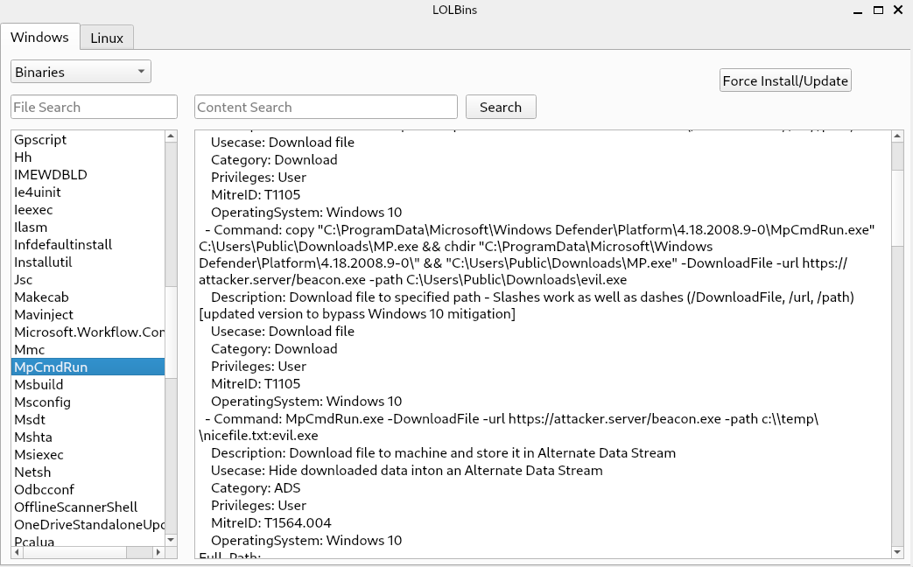

# LOLBins

 

PyQT app to list all Living Off The Land Binaries and Scripts for Windows from [LOLBAS](https://github.com/LOLBAS-Project/LOLBAS) and Unix binaries that can be used to bypass local security restrictions in misconfigured systems from [GTFOBins](https://github.com/GTFOBins/GTFOBins.github.io).

*Widnows*

*Linux*
